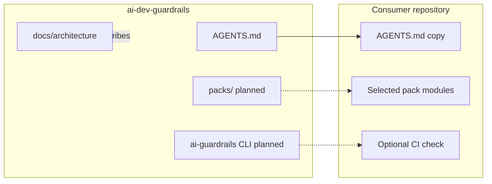

# Architecture diagram

Mermaid view of **this** repository’s surfaces and how a consumer repo relates to them. Docs match reality: packs and the CLI are shown as *planned* until they exist in the tree.

Solid edges are current. Dashed edges are planned follow-up PRs.
