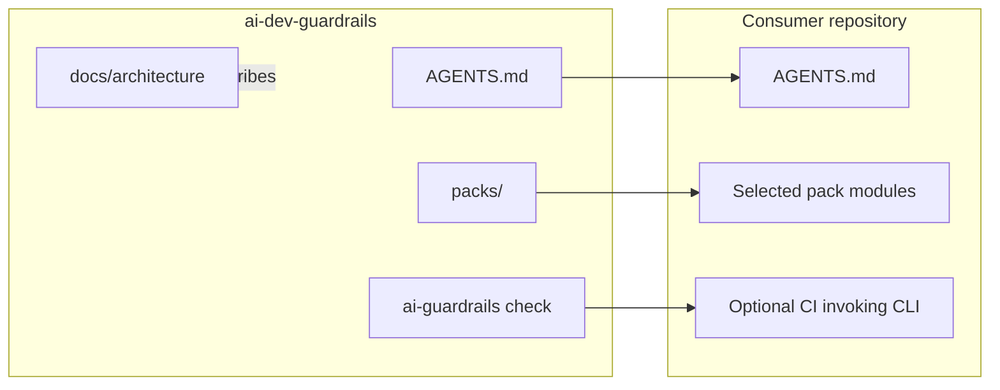

# Architecture diagram

```mermaid
flowchart LR
  subgraph packRepo["ai-dev-guardrails"]
    AG["AGENTS.md"]
    DOC["docs/architecture"]
    PACKS["packs/"]
    CLI["ai-guardrails check"]
  end

  subgraph consumer["Consumer repository"]
    CAG["AGENTS.md"]
    CMOD["Selected pack modules"]
    CCI["Optional CI invoking CLI"]
  end

  AG --> CAG
  PACKS --> CMOD
  CLI --> CCI
  DOC -. describes .-> packRepo
```

All solid edges reflect files that exist in this repository today. Consumer CI wiring is optional and owned by the consumer.
