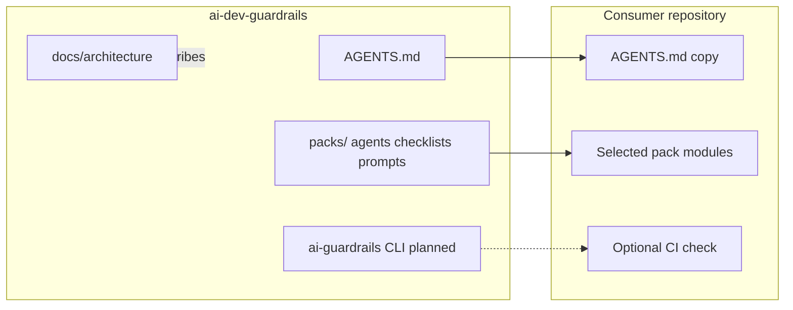

# Architecture diagram

Mermaid view of **this** repository’s surfaces and how a consumer repo relates to them.

Solid edges are current. The CLI edge remains planned until the Python package ships.
