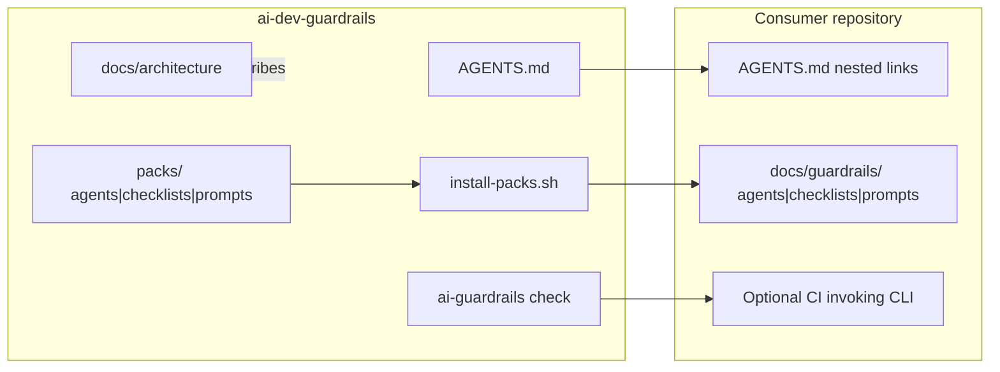

# Architecture diagram

All solid edges reflect files that exist in this repository today. Consumer CI wiring is optional and owned by the consumer.

Install preserves nested `agents/` / `checklists/` / `prompts/` paths (ADR-007 / ADR-008). Flat 0.2.x leftovers are warned, not deleted — see [migrate-nested-install.md](../references/migrate-nested-install.md).
